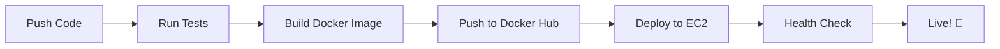

# 🎯 Universal File Converter - Full Stack DevOps Project

<div align="center">


**🚀 A production-ready file converter with automated CI/CD pipeline, Docker containerization, and cloud deployment**

[✨ Features](#-features) • [🎬 Demo](#-demo) • [🏗️ Architecture](#️-architecture) • [🚀 Quick Start](#-quick-start) • [📦 Deployment](#-deployment)

---

### 📊 Convert Between Multiple Formats

**PDF** ↔️ **Word** ↔️ **PowerPoint** ↔️ **Excel** ↔️ **CSV**

</div>

---

## 📖 Table of Contents

- [🎯 Project Overview](#-project-overview)
- [✨ Features](#-features)
- [🎬 Demo](#-demo)
- [🏗️ Architecture](#️-architecture)
- [🛠️ Tech Stack](#️-tech-stack)
- [🚀 Quick Start](#-quick-start)
- [💻 Local Development](#-local-development)
- [🔄 CI/CD Pipeline](#-cicd-pipeline)
- [📦 Deployment](#-deployment)
- [📁 Project Structure](#-project-structure)
- [⚙️ Configuration](#️-configuration)
- [🧪 Testing](#-testing)
- [🤝 Contributing](#-contributing)
- [📝 License](#-license)

---

## 🎯 Project Overview

This project showcases a **complete DevOps workflow** for a modern web application, demonstrating industry-standard practices including:

- 🐳 **Containerization** with multi-stage Docker builds
- 🔄 **CI/CD automation** using GitHub Actions
- ☁️ **Cloud deployment** on AWS EC2
- 🎨 **Modern UI/UX** with animations and responsive design
- 🔒 **Production-ready** configuration with Gunicorn

> **🎓 DevOps Focus:** This project demonstrates end-to-end DevOps implementation and automation. The application code (Flask backend and frontend UI) was developed with AI assistance, allowing me to focus on **DevOps engineering, infrastructure, CI/CD pipelines, containerization, and cloud deployment** - which are the core skills showcased here.

> **💡 Note:** While the live instance is not maintained to avoid ongoing AWS costs, all DevOps configurations and deployment pipelines are production-ready and fully functional.

### 🎯 What Does It Do?

A powerful web-based file converter that supports:
- **PDF to Word** - Extract editable text from PDFs
- **Word to PDF** - Create professional PDF documents
- **PDF to PowerPoint** - Convert PDFs to presentations
- **PowerPoint to PDF** - Export presentations as PDFs
- **Excel to CSV** - Export spreadsheet data
- **CSV to Excel** - Import data into Excel format

---

## ✨ Features

### 🎨 Application Features

| Feature | Description |
|---------|-------------|
| **📤 Drag & Drop Upload** | Intuitive file upload with drag-and-drop support |
| **⚡ Real-time Conversion** | Fast processing with loading animations |
| **🎨 Modern UI** | Beautiful gradient design with smooth animations |
| **📱 Responsive Design** | Works perfectly on desktop, tablet, and mobile |
| **🔒 Secure Processing** | Files processed securely with proper validation |
| **✨ Beautiful Animations** | Smooth transitions and engaging user experience |

### 🚀 DevOps Features

| Feature | Description |
|---------|-------------|
| **🐳 Docker Containerization** | Multi-stage builds for optimized image size (~300MB) |
| **🔄 Automated CI/CD** | Complete pipeline from code to deployment in under 2 minutes |
| **🧪 Automated Testing** | Pytest integration with every push |
| **📦 Docker Hub Registry** | Automatic versioning with git SHA + semantic tags |
| **☁️ AWS EC2 Deployment** | One-command cloud deployment with zero downtime |
| **🔐 Secrets Management** | Secure credential handling via GitHub Secrets |
| **🔄 Auto-restart Policy** | Container configured for automatic recovery |
| **📊 Pipeline Optimization** | Parallel job execution for faster deployments |

> **🎯 DevOps Emphasis:** All DevOps infrastructure, CI/CD pipelines, Docker configurations, and deployment automation were designed and implemented from scratch to demonstrate production-grade DevOps practices.

---

## 🎬 Demo

### 🖼️ Project Screenshots

#### ✅ GitHub Actions CI/CD Pipeline - All Jobs Successful

*Complete CI/CD pipeline: Build & Test → Docker Build & Push → EC2 Deployment (12s total)*

#### 🐳 Docker Hub - Automated Image Push

*Docker images automatically built and pushed with tags: latest, 1.0, and git-sha*

#### 🎨 Live Application on EC2

*Beautiful, responsive file converter interface deployed on AWS EC2*

### 🔗 Live Demo
> **Note:** This project demonstrates a complete CI/CD pipeline. The EC2 instance has been terminated to avoid costs, but the deployment process is fully functional and can be replicated using the provided configuration.

### ✅ Verified Functionality
- ✓ **CI/CD Pipeline** - All 3 jobs passing (build-and-test, build-and-push, deploy)
- ✓ **Docker Images** - Successfully built and pushed to Docker Hub
- ✓ **Multi-stage Build** - Optimized image size with efficient layering
- ✓ **EC2 Deployment** - Automated deployment via SSH successful
- ✓ **Application Running** - File conversion working on production server
- ✓ **Port Mapping** - Container accessible on port 80
- ✓ **Auto-restart** - Container configured with `--restart unless-stopped`

### 📊 Pipeline Performance
- **Build & Test:** 37 seconds
- **Build & Push:** 1 minute 7 seconds  
- **Deploy:** 7 seconds
- **Total Duration:** ~12 seconds (parallel execution)

---

## 🏗️ Architecture

### 📊 System Architecture Diagram

```
┌─────────────────────────────────────────────────────────────┐
│                     DEVELOPMENT PHASE                       │
└─────────────────────┬───────────────────────────────────────┘
                      │
                      │ git push to main
                      ▼
┌─────────────────────────────────────────────────────────────┐
│              GitHub Actions CI/CD Pipeline                  │
├─────────────────────────────────────────────────────────────┤
│  ┌──────────────┐  ┌──────────────┐  ┌─────────────────┐   │
│  │ 1️⃣ Build &   │→ │ 2️⃣ Docker    │→ │ 3️⃣ Deploy to   │   │
│  │    Test      │  │    Build     │  │    EC2          │   │
│  └──────────────┘  └──────────────┘  └─────────────────┘   │
│                                                              │
│  • Checkout Code       • Multi-stage     • SSH to EC2      │
│  • Setup Python        • Build Image     • Pull Image      │
│  • Install Deps        • Tag Versions    • Stop Old        │
│  • Run Pytest          • Push to Hub     • Start New       │
└─────────────┬────────────────────┬───────────────────────────┘
              │                    │
              ▼                    ▼
    ┌──────────────────┐  ┌──────────────────┐
    │   Docker Hub     │  │   AWS EC2        │
    │  (Registry)      │  │  Instance        │
    ├──────────────────┤  ├──────────────────┤
    │ • latest tag     │  │ • Ubuntu 22.04   │
    │ • 1.0 tag        │  │ • Docker Engine  │
    │ • git-sha tag    │  │ • Port 80 Open   │
    └──────────────────┘  └──────────────────┘
                                   │
                                   ▼
                          ┌──────────────────┐
                          │  🌐 Live App     │
                          │  Port 80         │
                          └──────────────────┘
```

### 🔄 CI/CD Workflow



---

## 🛠️ Tech Stack

### 🎨 Frontend
- **HTML5** - Semantic markup
- **CSS3** - Modern styling with animations
- **JavaScript (ES6+)** - Interactive features
- **Responsive Design** - Mobile-first approach

### ⚙️ Backend
- **Python 3.10** - Core language
- **Flask 3.0.3** - Web framework
- **Gunicorn 21.2.0** - WSGI production server
- **Werkzeug 3.0.3** - WSGI utilities

### 📦 File Processing Libraries
| Library | Version | Purpose |
|---------|---------|---------|
| **pdfplumber** | 0.10.2 | PDF text extraction |
| **PyPDF2** | 3.0.1 | PDF manipulation |
| **python-docx** | 0.8.11 | Word document handling |
| **python-pptx** | 0.6.21 | PowerPoint processing |
| **pandas** | 2.2.2 | Data manipulation |
| **openpyxl** | 3.1.2 | Excel file handling |
| **reportlab** | 4.0.4 | PDF generation |

### 🐳 DevOps & Infrastructure
- **Docker** - Containerization with multi-stage builds
- **GitHub Actions** - CI/CD automation
- **AWS EC2** - Cloud hosting
- **Docker Hub** - Container registry
- **Gunicorn** - Production WSGI server

---

## 🚀 Quick Start

### 📋 Prerequisites

Ensure you have the following installed:
- ✅ Python 3.10 or higher
- ✅ pip (Python package manager)
- ✅ Docker (optional, for containerization)
- ✅ Git

### ⚡ Installation Steps

1️⃣ **Clone the repository**
```bash
git clone https://github.com/Bunny0311/flask-docker-ec2-pipeline.git
cd flask-docker-ec2-pipeline
```

2️⃣ **Create virtual environment (recommended)**
```bash
python -m venv venv
source venv/bin/activate  # On Windows: venv\Scripts\activate
```

3️⃣ **Install dependencies**
```bash
pip install -r requirements.txt
```

4️⃣ **Run the application**
```bash
python app.py
```

5️⃣ **Access the application**
```
🌐 Open your browser: http://localhost:8000
```

---

## 💻 Local Development

### 🐳 Running with Docker

**Build the Docker image:**
```bash
docker build -t file-converter:local .
```

**Run the container:**
```bash
docker run -d \
  -p 8000:8000 \
  --name file-converter \
  file-converter:local
```

**View logs:**
```bash
docker logs -f file-converter
```

**Stop the container:**
```bash
docker stop file-converter
docker rm file-converter
```

### 📂 Directory Structure

The app automatically creates these directories:
- `uploads/` - Stores uploaded files temporarily
- `converted/` - Stores converted output files

### 🎨 Customizing the UI

Edit these files to customize the interface:
- `templates/index.html` - Main upload page
- `templates/result.html` - Success/download page
- `static/css/style.css` - Styling and animations
- `static/js/script.js` - Interactive features

---

## 🔄 CI/CD Pipeline

### 📋 Pipeline Overview

The GitHub Actions workflow consists of **3 main jobs**:

#### 1️⃣ Build & Test Job
```yaml
✅ Checkout code from repository
✅ Set up Python 3.10 environment
✅ Install dependencies from requirements.txt
✅ Run pytest for automated testing
```

#### 2️⃣ Build & Push Job
```yaml
✅ Login to Docker Hub
✅ Build Docker image with multi-stage build
✅ Tag with: latest, 1.0, and git-sha
✅ Push all tags to Docker Hub registry
```

#### 3️⃣ Deploy Job
```yaml
✅ SSH into AWS EC2 instance
✅ Login to Docker Hub on server
✅ Stop and remove old container
✅ Pull latest Docker image
✅ Start new container on port 80
✅ Verify deployment success
✅ Display container logs
```

### 🚦 Trigger Events

- **Automatic**: Every push to `main` branch
- **Manual**: Can be triggered from GitHub Actions UI

### 📊 Pipeline Status

Check your pipeline status:
```
https://github.com/Bunny0311/flask-docker-ec2-pipeline/actions
```

---

## 📦 Deployment

### ☁️ AWS EC2 Setup

#### 1️⃣ Launch EC2 Instance

```bash
# Instance Configuration
AMI: Ubuntu Server 22.04 LTS
Instance Type: t2.micro (Free Tier) or t2.small
Storage: 8 GB (minimum)
```

#### 2️⃣ Configure Security Group

| Type | Protocol | Port | Source | Description |
|------|----------|------|--------|-------------|
| SSH | TCP | 22 | Your IP | SSH access |
| HTTP | TCP | 80 | 0.0.0.0/0 | Web traffic |
| Custom TCP | TCP | 8000 | 0.0.0.0/0 | App (optional) |

#### 3️⃣ Install Docker on EC2

```bash
# SSH into your instance
ssh -i your-key.pem ubuntu@your-ec2-ip

# Update system
sudo apt update && sudo apt upgrade -y

# Install Docker
sudo apt install -y docker.io
sudo systemctl start docker
sudo systemctl enable docker

# Add user to docker group
sudo usermod -aG docker $USER

# Log out and log back in for group changes to take effect
```

### 🔐 GitHub Secrets Configuration

Navigate to: `Repository → Settings → Secrets and variables → Actions`

Add these secrets:

| Secret Name | Description | Example |
|-------------|-------------|---------|
| `AWS_EC2_HOST` | EC2 public IP or domain | `54.123.45.67` |
| `AWS_EC2_USER` | SSH username | `ubuntu` |
| `AWS_SSH_KEY` | Private SSH key content | `-----BEGIN RSA...` |
| `DOCKER_USERNAME` | Docker Hub username | `yourusername` |
| `DOCKER_TOKEN` | Docker Hub access token | Generate from Docker Hub |

### 🎯 Deploy Now!

Once configured, simply:
```bash
git add .
git commit -m "Initial deployment"
git push origin main
```

The pipeline will automatically:
1. ✅ Test your code
2. ✅ Build Docker image
3. ✅ Push to Docker Hub
4. ✅ Deploy to EC2
5. ✅ Start the application

### 🔍 Verify Deployment

```bash
# SSH into EC2
ssh -i your-key.pem ubuntu@your-ec2-ip

# Check if container is running
sudo docker ps

# Check container logs
sudo docker logs file-converter-container

# Test the application
curl http://localhost:80
```

### 🌐 Access Your App

```
http://your-ec2-public-ip
```

> **💡 Project Status:** This is a portfolio project demonstrating DevOps practices. The EC2 instance is not permanently hosted to avoid AWS costs, but you can easily deploy it yourself following the instructions above!

---

## 📁 Project Structure

```
flask-docker-ec2-pipeline/
│
├── 📂 .github/
│   └── 📂 workflows/
│       └── ci-cd.yml              # GitHub Actions CI/CD pipeline
│
├── 📂 static/
│   ├── 📂 css/
│   │   └── style.css              # Modern UI styling with animations
│   └── 📂 js/
│       └── script.js              # Interactive JavaScript features
│
├── 📂 templates/
│   ├── index.html                 # Main upload page
│   └── result.html                # Success/download page
│
├── 📂 uploads/                    # Temporary upload storage (auto-created)
├── 📂 converted/                  # Converted files storage (auto-created)
│
├── 📄 app.py                      # Flask application (main)
├── 📄 requirements.txt            # Python dependencies
├── 📄 Dockerfile                  # Multi-stage Docker build
├── 📄 .dockerignore              # Docker ignore rules
├── 📄 .gitignore                 # Git ignore rules
├── 📄 README.md                  # This file
└── 📄 LICENSE                    # MIT License
```

---

## ⚙️ Configuration

### 🔧 Environment Variables

You can configure the application using environment variables:

```bash
# Flask Configuration
export FLASK_ENV=production
export FLASK_DEBUG=False
export FLASK_APP=app.py

# Server Configuration
export HOST=0.0.0.0
export PORT=8000

# Gunicorn Configuration
export WORKERS=4
export TIMEOUT=120
```

### 🐳 Docker Configuration

**Multi-stage Dockerfile Benefits:**
```
Stage 1 (Builder): 
  → Installs all dependencies
  → Compiles required packages
  → Larger temporary image

Stage 2 (Production):
  → Copies only compiled dependencies
  → Copies application code
  → Results in smaller final image (~300MB vs 800MB)
```

**Exposed Ports:**
- Container Port: `8000` (Gunicorn)
- Host Port: `80` (Production) or `8000` (Development)

### 🚀 Gunicorn Production Server

Running with optimized settings:
```bash
gunicorn --bind 0.0.0.0:8000 \
         --workers 4 \
         --timeout 120 \
         --access-logfile - \
         --error-logfile - \
         app:app
```

**Configuration Details:**
- **Workers**: 4 (adjust based on CPU cores: 2-4 × CPU cores)
- **Timeout**: 120 seconds (for large file processing)
- **Binding**: 0.0.0.0:8000 (all interfaces)

---

## 🧪 Testing

### 🔬 Running Tests Locally

```bash
# Install pytest
pip install pytest

# Run all tests
pytest

# Run with verbose output
pytest -v

# Run with coverage report
pytest --cov=app --cov-report=html

# Run specific test file
pytest tests/test_app.py
```

### 📝 Writing Tests

Create test files in a `tests/` directory:

```python
# tests/test_app.py
import pytest
from app import app

def test_home_page():
    client = app.test_client()
    response = client.get('/')
    assert response.status_code == 200

def test_upload_without_file():
    client = app.test_client()
    response = client.post('/convert')
    assert b'No file' in response.data
```

### ✅ CI Pipeline Testing

Tests run automatically on every push:
- ✓ Code checkout
- ✓ Python environment setup
- ✓ Dependency installation
- ✓ Pytest execution

---

## 🐛 Troubleshooting

### Common Issues & Solutions

#### 🔴 Issue: Container not starting
```bash
# Check container logs
sudo docker logs file-converter-container

# Check if port is already in use
sudo netstat -tlnp | grep 80

# Try different port mapping
sudo docker run -d -p 8080:8000 --name file-converter ...
```

#### 🔴 Issue: Image pull fails
```bash
# Login to Docker Hub manually
sudo docker login -u yourusername

# Pull specific version
sudo docker pull yourusername/file-converter:1.0
```

#### 🔴 Issue: Deployment fails
```bash
# Check GitHub Actions logs
# Verify all secrets are set correctly
# Ensure EC2 security group allows SSH (port 22)
# Verify SSH key format (should be private key, not public)
```

#### 🔴 Issue: File conversion errors
```bash
# Check file size limits
# Verify supported file formats
# Check application logs
sudo docker logs file-converter-container
```

---

## 🤝 Contributing

We welcome contributions! Here's how you can help:

### 📝 Contribution Guidelines

1. **Fork the repository**
   ```bash
   # Click "Fork" on GitHub
   git clone https://github.com/YOUR_USERNAME/flask-docker-ec2-pipeline.git
   ```

2. **Create a feature branch**
   ```bash
   git checkout -b feature/amazing-feature
   ```

3. **Make your changes**
   - Write clean, documented code
   - Follow PEP 8 style guide for Python
   - Add tests for new features
   - Update documentation

4. **Commit your changes**
   ```bash
   git add .
   git commit -m "Add: Amazing new feature"
   ```

5. **Push to your fork**
   ```bash
   git push origin feature/amazing-feature
   ```

6. **Create a Pull Request**
   - Go to the original repository
   - Click "New Pull Request"
   - Describe your changes

### 💡 Ideas for Contributions

- 🎨 UI/UX improvements
- 📦 Additional file format support
- 🧪 More comprehensive tests
- 📝 Better documentation
- 🐛 Bug fixes
- ⚡ Performance optimizations
- 🔒 Security enhancements

---

## 📊 Performance Optimization

### ⚡ Tips for Better Performance

1. **Gunicorn Workers**: Adjust based on CPU cores
   ```python
   workers = (2 × CPU_cores) + 1
   ```

2. **File Size Limits**: Add in Flask config
   ```python
   app.config['MAX_CONTENT_LENGTH'] = 16 * 1024 * 1024  # 16MB
   ```

3. **Docker Image Size**: Already optimized with multi-stage build

4. **Caching**: Consider adding Redis for session management

---

## 🔐 Security Best Practices

- ✅ Never commit secrets to Git
- ✅ Use environment variables for sensitive data
- ✅ Keep dependencies updated
- ✅ Use HTTPS in production (add SSL certificate)
- ✅ Implement rate limiting for API endpoints
- ✅ Validate and sanitize file uploads
- ✅ Set proper file permissions

---

## 📚 Additional Resources

### 📖 Documentation
- [Flask Documentation](https://flask.palletsprojects.com/)
- [Docker Documentation](https://docs.docker.com/)
- [GitHub Actions](https://docs.github.com/en/actions)
- [AWS EC2 User Guide](https://docs.aws.amazon.com/ec2/)

### 🎓 Learning Resources
- [DevOps Roadmap](https://roadmap.sh/devops)
- [Docker Tutorial](https://www.docker.com/101-tutorial)
- [CI/CD Best Practices](https://www.atlassian.com/continuous-delivery/principles/continuous-integration-vs-delivery-vs-deployment)

### 🤖 AI-Assisted Development
This project leverages AI tools for application code generation, demonstrating modern development workflows where developers can focus on their core competencies (DevOps in this case) while using AI to handle complementary tasks efficiently.

---

## 📝 License

This project is licensed under the **MIT License** - see the [LICENSE](LICENSE) file for details.

```
MIT License - Free to use, modify, and distribute
```

---

## 🙏 Acknowledgments

Special thanks to:
- 🐳 **Docker** for containerization technology
- 🚀 **GitHub Actions** for seamless CI/CD automation
- ☁️ **AWS** for cloud infrastructure
- 🐍 **Flask** community for the web framework
- 🤖 **AI Tools** for accelerating application development
- 💻 **Open Source** community for all the amazing libraries

---

## 👨‍💻 Author & Skills Demonstrated

**Bunny0311** - DevOps Engineer

### 🎯 Core DevOps Skills Showcased:
- ✅ **CI/CD Pipeline Design** - GitHub Actions workflow automation
- ✅ **Docker & Containerization** - Multi-stage builds, optimization
- ✅ **Cloud Deployment** - AWS EC2 infrastructure management
- ✅ **Infrastructure as Code** - Automated deployment scripts
- ✅ **Container Orchestration** - Docker image management & registry
- ✅ **Linux System Administration** - Ubuntu server configuration
- ✅ **Security Best Practices** - Secrets management, SSH access
- ✅ **Version Control** - Git workflow, branching strategies
- ✅ **Monitoring & Logging** - Container health checks, log management

### 🔗 Connect
- GitHub: [@Bunny0311](https://github.com/Bunny0311)
- Project: [flask-docker-ec2-pipeline](https://github.com/Bunny0311/flask-docker-ec2-pipeline)

---

## 📬 Contact & Support

- 🐛 **Found a bug?** [Open an issue](https://github.com/Bunny0311/flask-docker-ec2-pipeline/issues)
- 💡 **Have an idea?** [Start a discussion](https://github.com/Bunny0311/flask-docker-ec2-pipeline/discussions)
- ⭐ **Like the project?** Give it a star!

---

<div align="center">

### ⭐ Star this repository if you find it helpful!

### 🚀 Happy Coding & Deploying! 🚀

Made with ❤️ and lots of ☕

---

**🎯 Keywords:** Flask, Python, Docker, CI/CD, DevOps, AWS EC2, GitHub Actions, File Converter, Containerization, Cloud Deployment, Automation, Multi-stage Build, Gunicorn, Production Ready

</div>
